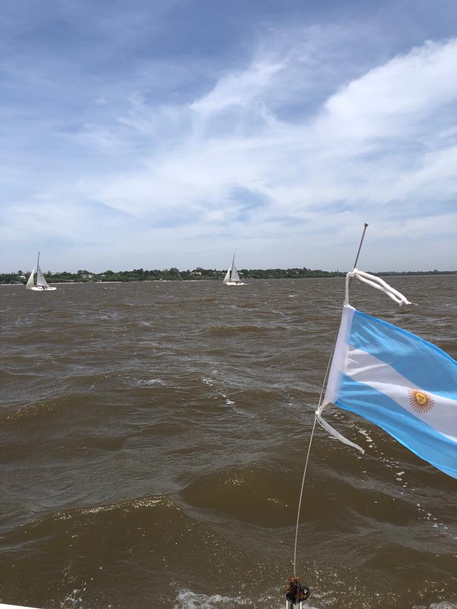

# Inicio 
 

https://asackmann.github.io/CursoTimonel2023/

- [Inicio](#inicio)
- [Certificado de Timonel de Yate](#certificado-de-timonel-de-yate)
- [Curso Timonel 2do Sem 2023](#curso-timonel-2do-sem-2023)
  - [Programa de examen para timonel de yate](#programa-de-examen-para-timonel-de-yate)
  - [Fechas](#fechas)
  - [Modalidad](#modalidad)
  - [Barcos](#barcos)

# Certificado de Timonel de Yate

> - [Prefectura Naval - Programa de examen para timonel de yate](https://www.argentina.gob.ar/prefecturanaval/programa-de-examen-para-timonel-de-yate)
> - [Obtener el certificado de Timonel de Yate](https://www.argentina.gob.ar/servicio/obtener-el-certificado-de-timonel-de-yate)

La Prefectura Naval Argentina permite obtener el certificado náutico deportivo en las categorías: 
- Timonel de yate a vela
- Timonel de yate a motor
- Timonel de yate a vela y motor

Para manejar embarcaciones deportivas de hasta 12 metros (39 pies) de eslora que realicen navegación:
  - Lacustre y ríos interiores; en toda su extensión.
  - Río de la Plata: pudiendo alcanzar costas y puertos uruguayos con los siguientes límites de alejamientos; al oeste de la línea imaginaria que une Punta Atalaya (ARG) con Punta Rosario (República Oriental del Uruguay en proximidades a Juan Lacaze).
  - En otras zonas del Río de la Plata y en zona marítima hasta cinco millas náuticas (5MN) de la costa o los lugares que establezca la Prefectura jurisdiccional.

# Curso Timonel 2do Sem 2023

Timonel de yate a vela y motor

## Programa de examen para timonel de yate
- [Programa](programa.md) 

## Fechas
- Examen Escrito - Viernes 08 de diciembre / 17 hs
- Examen Oral – Jueves 14 de diciembre
- Examen Practico – Sábado 16 de diciembre 
- Viajes a Colonia en el Barco Náutico II, y dos o 3 barcos mas voluntarios.
  - 11 y 12 Nov fecha confirmada.
    - Si se pasa por cuestiones meteorologicas.
    - 18 y 19 Nov. 
---
## Modalidad
- 20 clases teoricas 
	- Viernes 19hs.
- 20 clases practicas
	- 15 clases de 4hs. sabado a la mañana. 
		- 9.30 a 12. MAÑANA 
		- 13 a 16hs. TARDE
	- ultimas 5 clases todo el dia de 9.30 a 16.hs
- Talo, Ken, para consultar dudas se le avisa y te juntas en la sala de yatching.
- 2 parciales o 1. para ver como estas parado.

-----------------

## Barcos

Ver [Listado de Barcos escuela del CNSI](barcos.md)