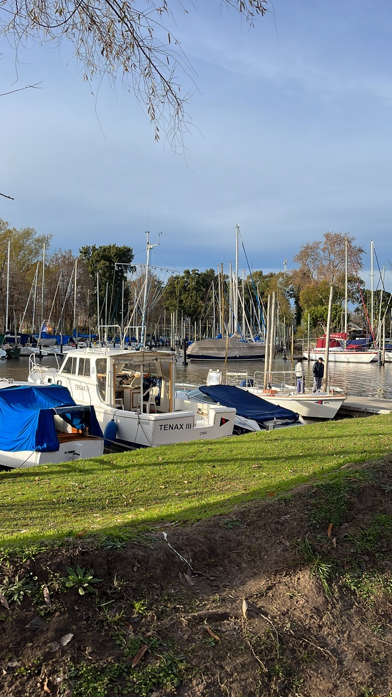
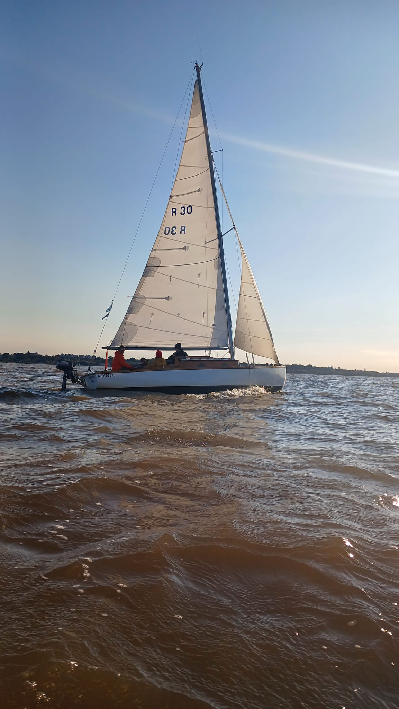
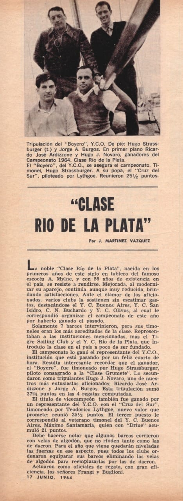

 

https://asackmann.github.io/CursoTimonel2023/

- [Certificado de Timonel de Yate](#certificado-de-timonel-de-yate)
- [Curso Timonel 2do Sem 2023](#curso-timonel-2do-sem-2023)
	- [Fechas](#fechas)
	- [Modalidad](#modalidad)
	- [Barcos](#barcos)
		- [Clase Rio de la Plata](#clase-rio-de-la-plata)

# Certificado de Timonel de Yate

> - [Prefectura Naval - Programa de examen para timonel de yate](https://www.argentina.gob.ar/prefecturanaval/programa-de-examen-para-timonel-de-yate)
> - [Obtener el certificado de Timonel de Yate](https://www.argentina.gob.ar/servicio/obtener-el-certificado-de-timonel-de-yate)

La Prefectura Naval Argentina permite obtener el certificado náutico deportivo en las categorías: 
- Timonel de yate a vela
- Timonel de yate a motor
- Timonel de yate a vela y motor

Para manejar embarcaciones deportivas de hasta 12 metros de eslora que realicen navegación:
  - Lacustre y ríos interiores; en toda su extensión.
  - Río de la Plata: pudiendo alcanzar costas y puertos uruguayos con los siguientes límites de alejamientos; al oeste de la línea imaginaria que une Punta Atalaya (ARG) con Punta Rosario (República Oriental del Uruguay en proximidades a Juan Lacaze).
  - En otras zonas del Río de la Plata y en zona marítima hasta cinco millas náuticas (5MN) de la costa o los lugares que establezca la Prefectura jurisdiccional.

# Curso Timonel 2do Sem 2023

Timonel de yate a vela y motor

## Fechas
- Examen Escrito - jueves 07 de diciembre
- Examen Oral – jueves 14 de diciembre
- Examen Practico – sábado 16 de diciembre // Puede llegar a ser Viernes. 15 dic.
- Viajes a Colonia en el Barco Náutico – 14 y 15 de octubre –18 y 19 de noviembre (Fechas tentativas)
---
## Modalidad
- 20 clases teoricas 
	- Viernes 19hs.
- 20 clases practicas
	- 15 clases de 4hs. sabado a la mañana. 
		- 9.30 a 12. MAÑANA 
		- 13 a 16hs. TARDE
	- ultimas 5 clases todo el dia de 9.30 a 16.hs
- Talo, Ken, para consultar dudas se le avisa y te juntas en la sala de yatching.
- 2 parciales o 1. para ver como estas parado.

-----------------

## Barcos
- Rio de la Plata, Avan, Mistic, J24, Dolphing 32pies., Nautico II.
	- Dolphing II, hace salidas miercoles, viernes y algun finde. Capitanes voluntarios a tener el mando.
  	- Cuando te anotas poner en Observaciones: Soy del curso de timonel.

### Clase Rio de la Plata

https://www.facebook.com/groups/claseriodelaplata/

 

 

 

<video controls>
  <source src="./images/video.laurel.mp4" type="video/mp4">
</video>

 > https://www.facebook.com/reel/1533333360380539

El Laurel ayer, con Nico Volpini al timón, en una de las postales clásicas de nuestro río. Con 100 años de actividad, la escuela del C.N.S.I. continúa formando timoneles en un tradicional yacht de Argentina.  