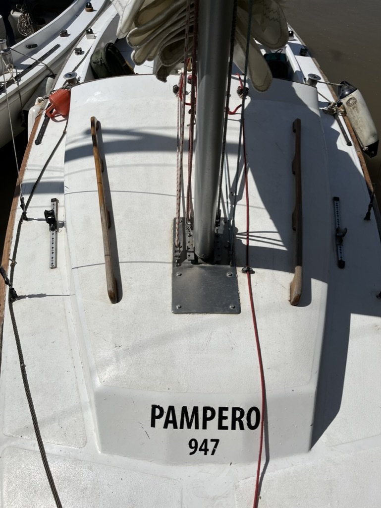
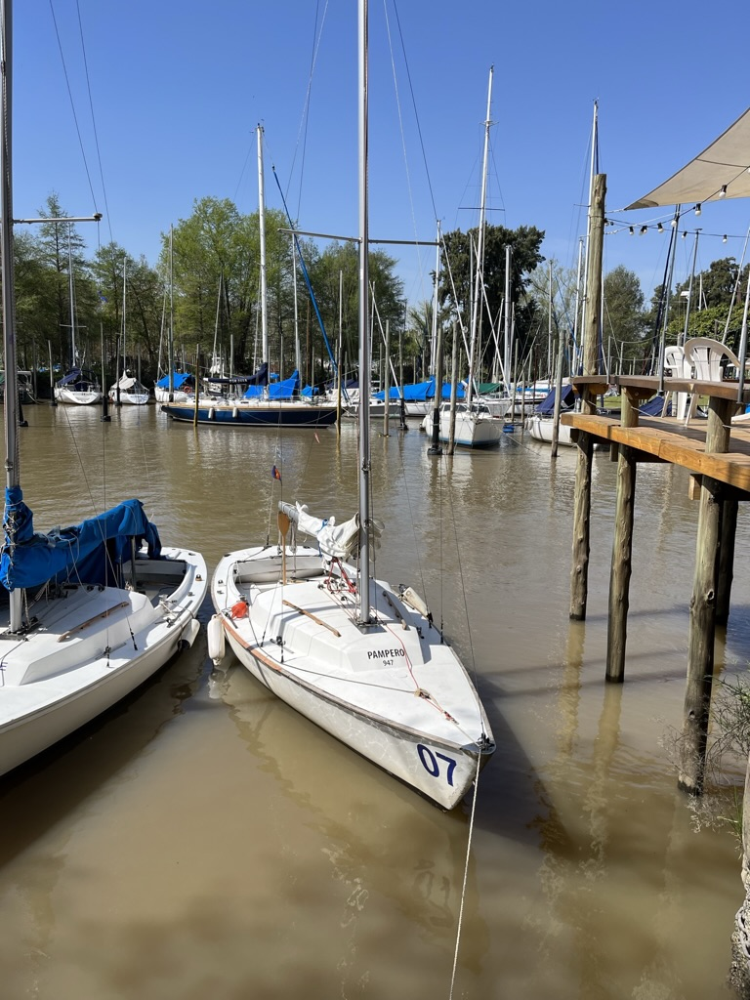
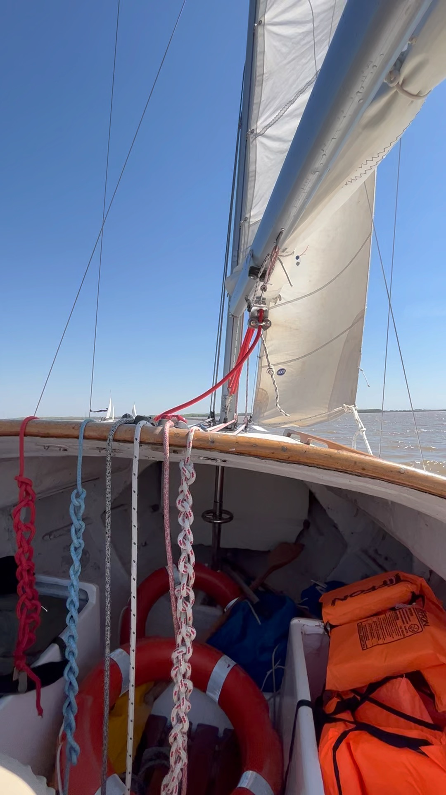
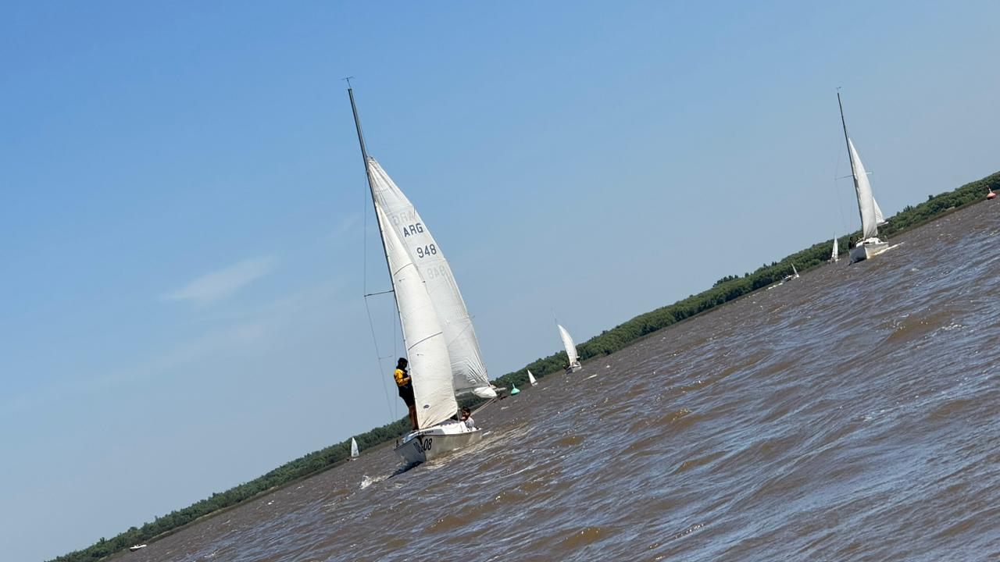
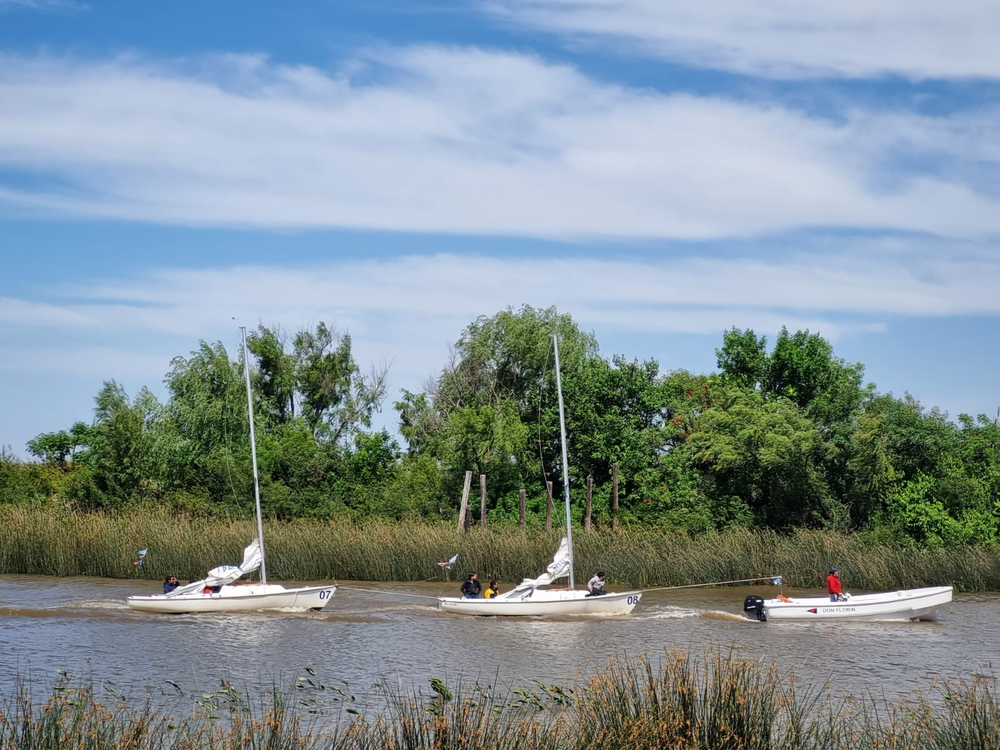
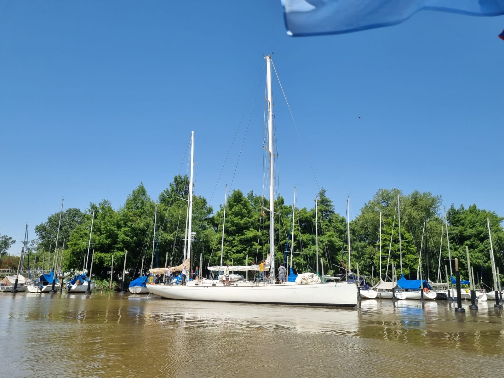
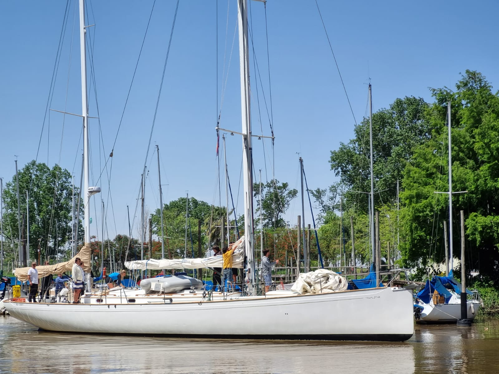

- [Barcos escuela CNSI](#barcos-escuela-cnsi)
  - [Clase Rio de la Plata](#clase-rio-de-la-plata)
  - [Avan](#avan)
  - [Mistic](#mistic)
  - [J24](#j24)
  - [Dolphin II](#dolphin-ii)
  - [Nautico II](#nautico-ii)

# Barcos escuela CNSI
- Rio de la Plata
- Avan
- Mistic
- J24
- Dolphin II (32pies)
  - Dolphin II, hace salidas miercoles, viernes y algun finde. Capitanes voluntarios a tener el mando.
  -  Cuando te anotas poner en Observaciones: Soy del curso de timonel.
-  Nautico II

## Clase Rio de la Plata

Calado
 - 1.30m con orsa
 - 0.30m sin orsa.
  
https://www.facebook.com/groups/claseriodelaplata/

> Junco

<video controls>
  <source src="./images/video.laurel.mp4" type="video/mp4">
</video>

> Laurel
> https://www.facebook.com/reel/1533333360380539
> El Laurel ayer, con Nico Volpini al timón, en una de las postales clásicas de nuestro río. Con 100 años de actividad, la escuela del C.N.S.I. continúa formando timoneles en un tradicional yacht de Argentina.  

## Avan

Calado 
- 1.15m

## Mistic

Calado
- 1.20m y 1.30m

## J24

Calado
- 1.40m

## Dolphin II 

Calado
- ??

## Nautico II

Calado
- 1.70m

<video controls>
  <source src="./images/nauticoII.mp4" type="video/mp4">
</video>