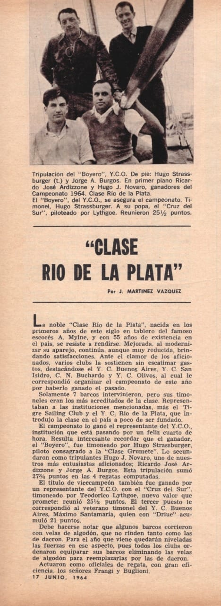

- [Barcos escuela CNSI](#barcos-escuela-cnsi)
  - [Clase Rio de la Plata](#clase-rio-de-la-plata)
  - [Avan](#avan)
  - [Mistic](#mistic)
  - [J24](#j24)
  - [Dolphin II](#dolphin-ii)
  - [Nautico II](#nautico-ii)

# Barcos escuela CNSI
- Rio de la Plata
- Avan
- Mistic
- J24
- Dolphin II (32pies)
  - Dolphin II, hace salidas miercoles, viernes y algun finde. Capitanes voluntarios a tener el mando.
  -  Cuando te anotas poner en Observaciones: Soy del curso de timonel.
-  Nautico II

## Clase Rio de la Plata

Calado
 - 1.30m con orsa
 - 0.30m sin orsa.
  
https://www.facebook.com/groups/claseriodelaplata/

> Junco

<video controls>
  <source src="./images/video.laurel.mp4" type="video/mp4">
</video>

> Laurel
> https://www.facebook.com/reel/1533333360380539
> El Laurel ayer, con Nico Volpini al timón, en una de las postales clásicas de nuestro río. Con 100 años de actividad, la escuela del C.N.S.I. continúa formando timoneles en un tradicional yacht de Argentina.  

## Avan

Calado 
- 1.15m

## Mistic

Calado
- 1.20m y 1.30m

## J24

Calado
- 1.40m

## Dolphin II 

Calado
- ??

## Nautico II

NAUTICO II - ARG5500	

- Clase PHRF 
- https://en.wikipedia.org/wiki/Performance_Handicap_Racing_Fleet
- https://www.cic.org.ar/formula-phrf.php
- http://cic.org.ar/subpaginas/listaderatings.html

https://germanfrers.net/portfolio_cats/custom/page/3/

Frers 60

Calado
- 1.70m
- Length Overall	18,5
- Waterline Length	15,18
- Beam	4,3
- Draft	1.5 / 3.5
- Displacement	19500
- Yard	Astillero Aries
- Year	2010

German Frers Design Nautico II: The Flagship of the San Isidro Yacht Club

The Nautico II holds the prestigious position of being the flagship yacht of the esteemed San Isidro Yacht Club. This vessel measures 18,5 meters in length overall and showcases a neoclassic design.

German Frers’ visionary design philosophy is evident throughout Nautico II. Its neoclassic styling blends timeless elegance with modern functionality, creating a yacht that is both visually striking and practical in its use.

As the pride of the San Isidro Yacht Club, this neoclassic symbolizes excellence and represents the highest standards of yacht design. Its presence is sure to captivate onlookers, both at the dock and during its ventures on the water.

The Nautico was built in 2010 by Astillero Aries.

<video controls>
  <source src="./images/nauticoII.mp4" type="video/mp4">
</video>