- [Pizarron](#pizarron)
- [Introducción teórica de la práctica en Yachting](#introducción-teórica-de-la-práctica-en-yachting)

# Pizarron

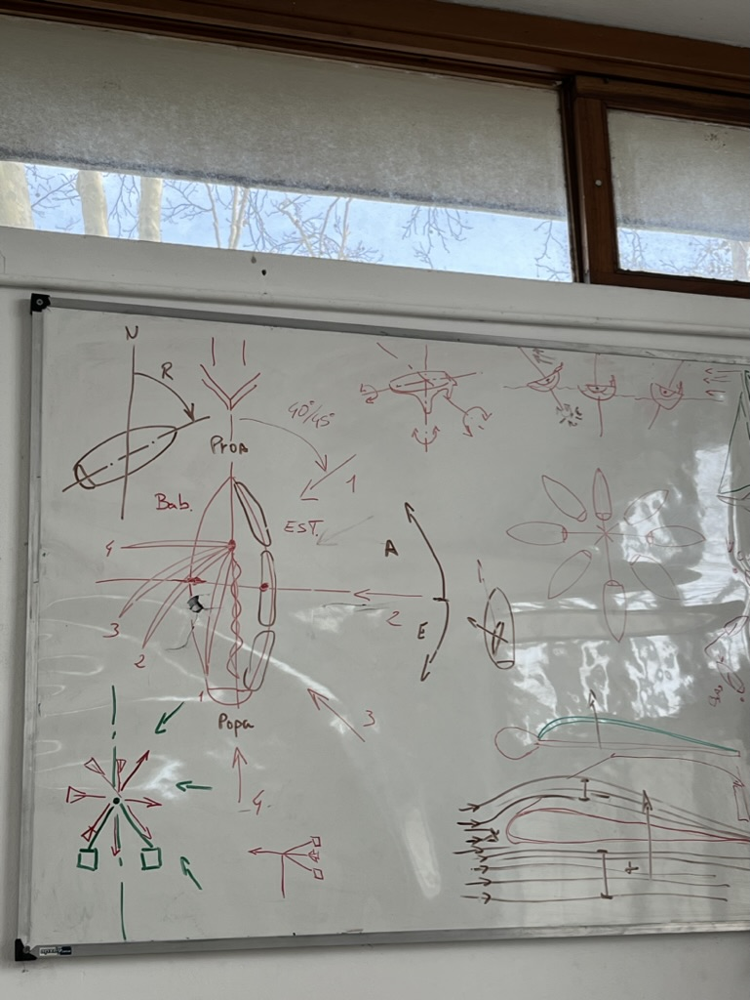
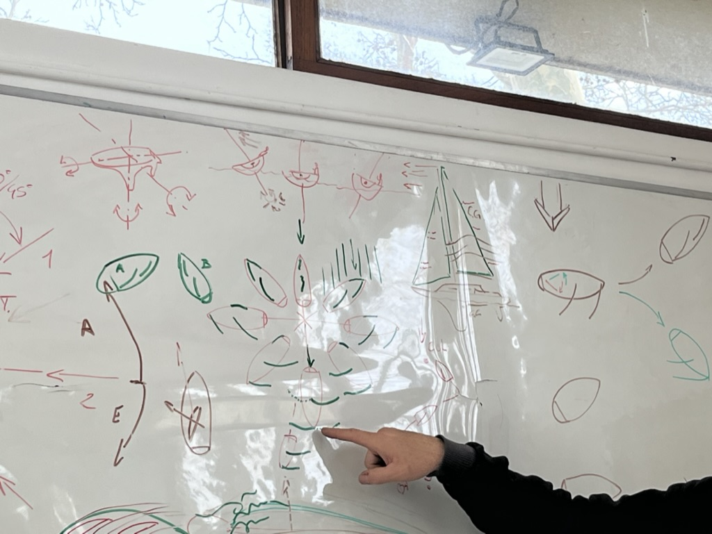

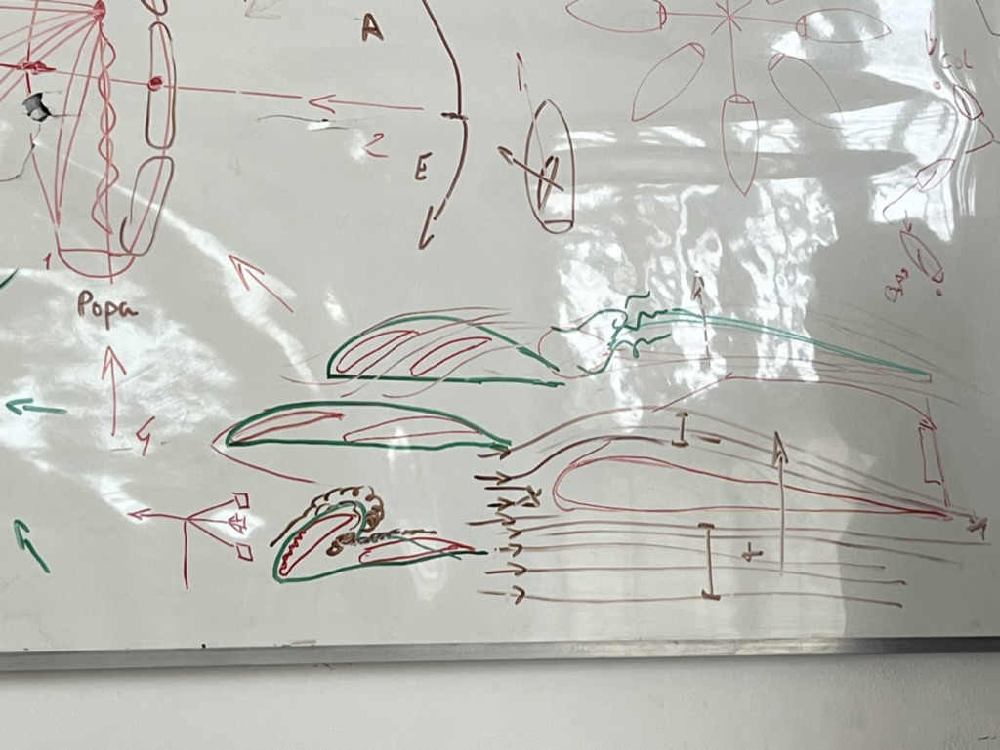
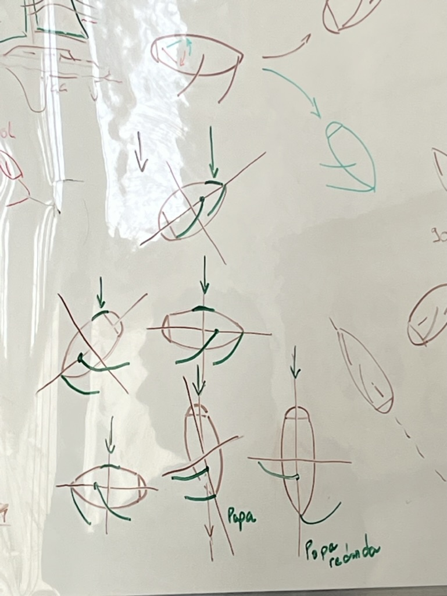

# Introducción teórica de la práctica en Yachting

[PDF](https://github.com/asackmann/CursoTimonel2023/blob/main/clases/20230729/attch/Introducci%C3%B3n%20te%C3%B3rica%20de%20la%20pr%C3%A1ctica%20en%20Yachting.pdf)

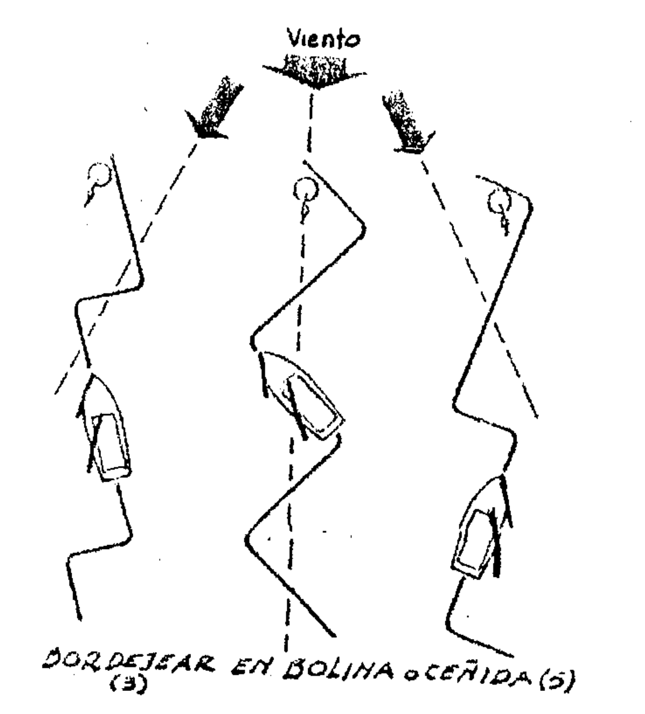
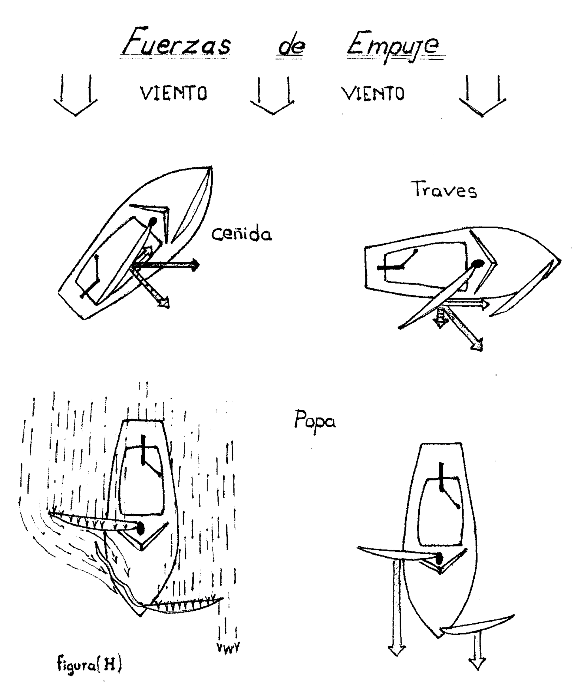
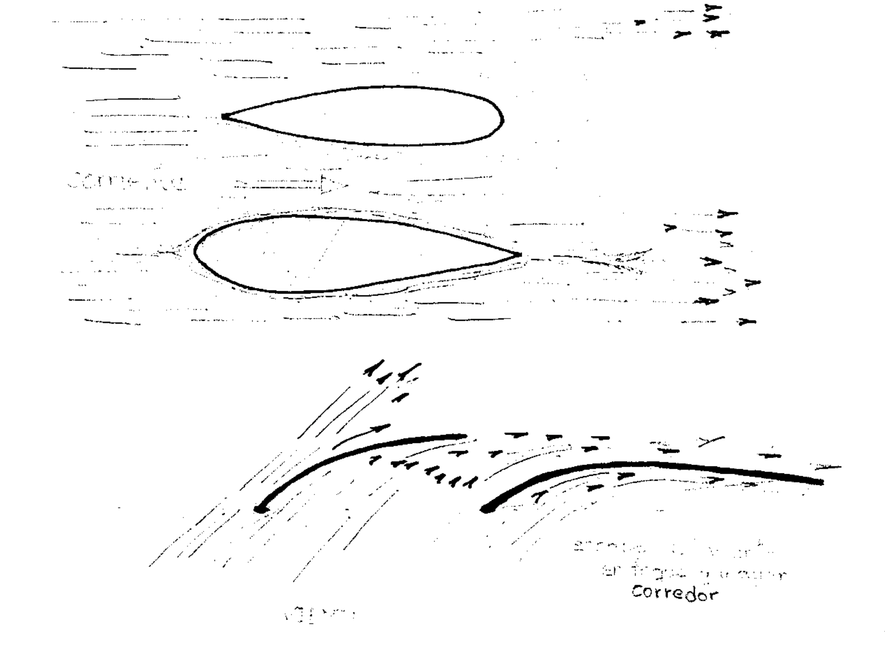
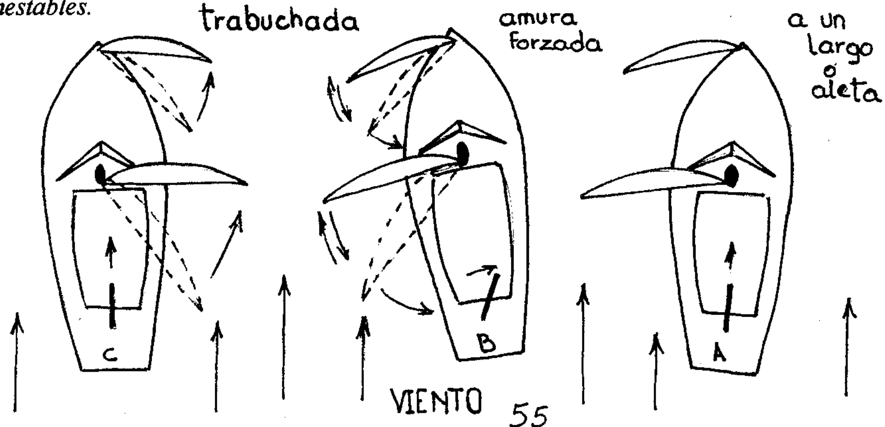
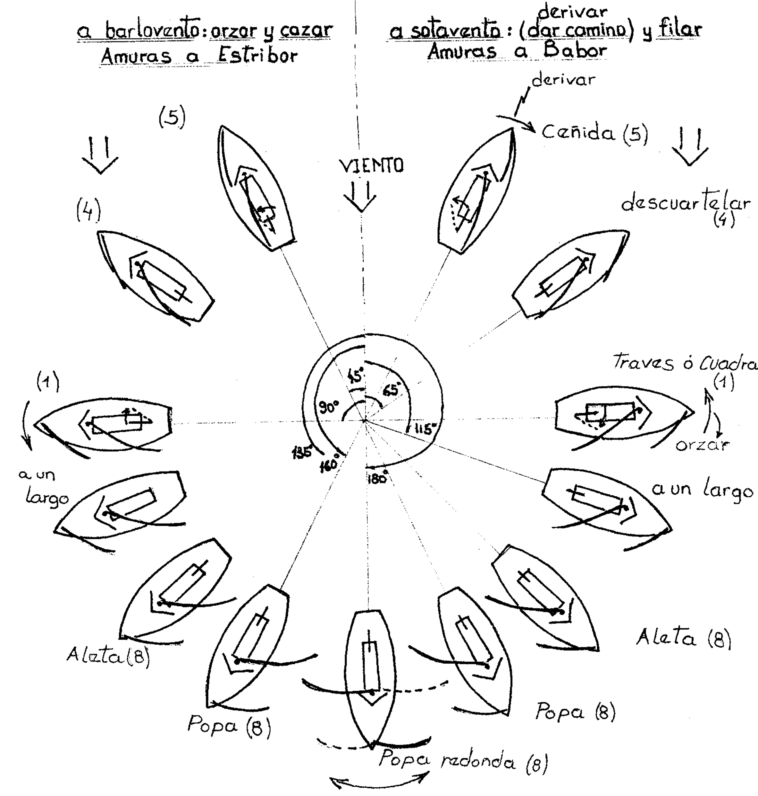
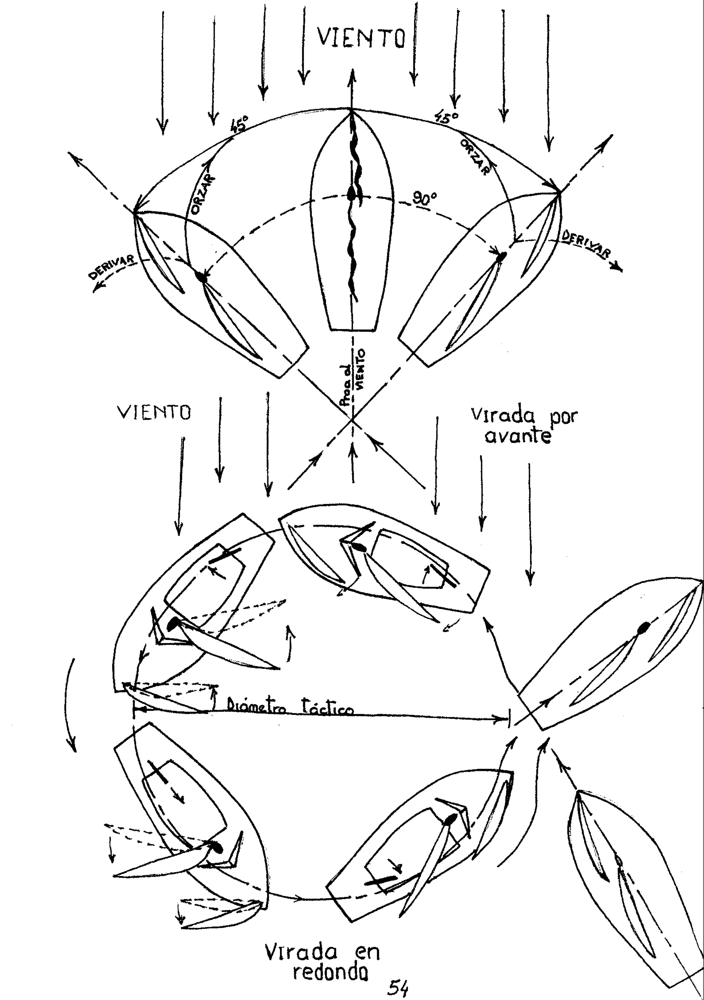

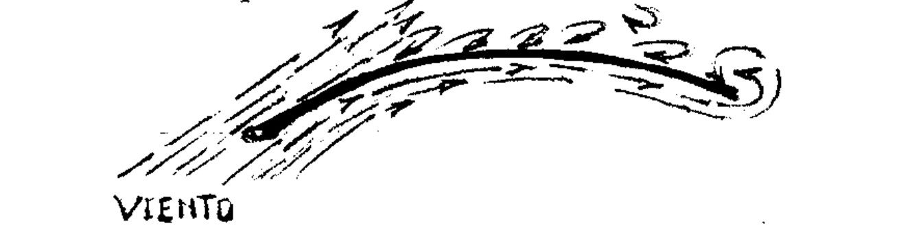
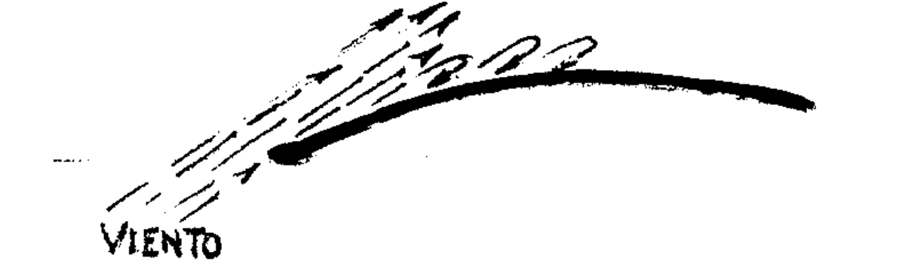
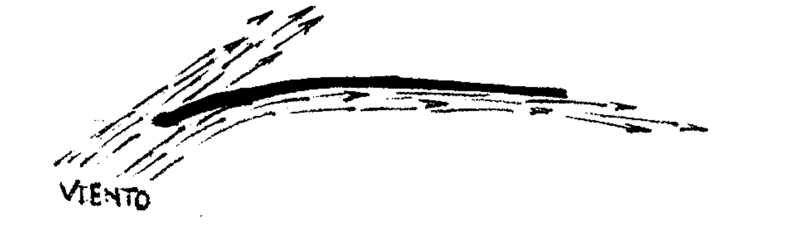
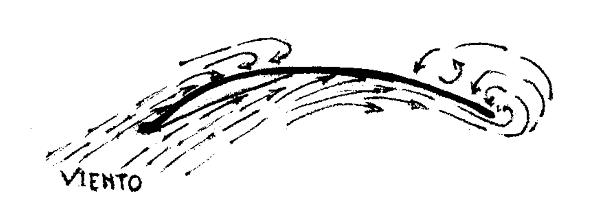
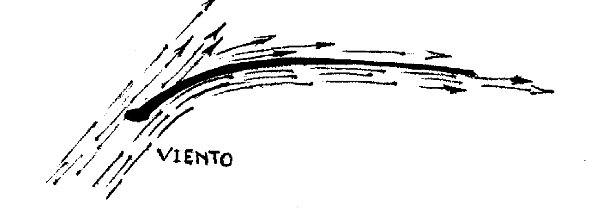
