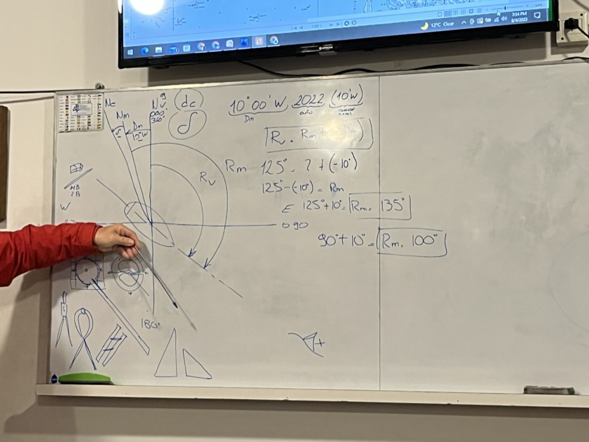
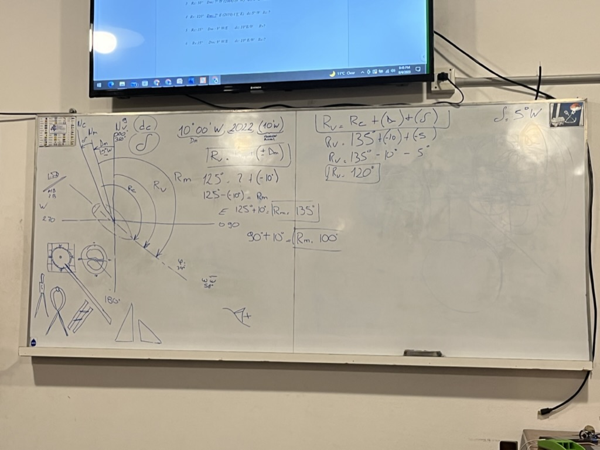
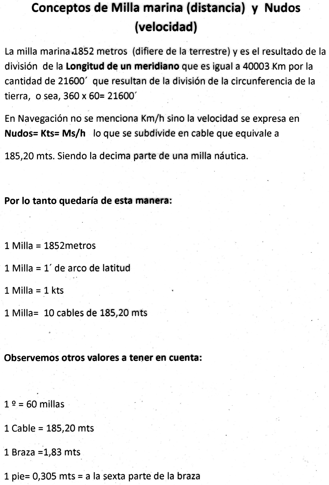

- [Pizarron](#pizarron)
- [1. RUMBO](#1-rumbo)
  - [Norte verdadero](#norte-verdadero)
  - [Norte magnetico](#norte-magnetico)
  - [Declinacion magnetica](#declinacion-magnetica)
  - [Desvio del compas gobierno](#desvio-del-compas-gobierno)
  - [Formula](#formula)
  - [Equivalencias](#equivalencias)
  - [Instrumentos de precision](#instrumentos-de-precision)
- [TAREA PARA LA PROX CLASE](#tarea-para-la-prox-clase)

# Pizarron

# 1. RUMBO

> Timonel: Navegacion por estima a vista de costa.
> Patron: Navegacion por estima a vista de costa y navegacion astronimica.

Siempre recordar la flecha para graficar el rumbo, desde / hasta.
En sentido horario.

Angulo formado entre norte y eje de crujida, medido desde 0 hasta el eje.
## Norte verdadero
- Norte verdadero / geografico / Lo dice la rosa exterior, en el 0 grados.
  - Te lo da la carta
  - Meridiano verdadero
  - Rumbo verdadero por que inicia con el norte verdadero.
  - Latitud, longitud y rumbo verdadero.
## Norte magnetico
- Norte magnetico, es el norte propio de la tierra.
  - Meridiano magnetico  
  - Te lo da el compas de gobierno.

## Declinacion magnetica
- Declinacion magnetica: La diferencia entre el norte verdader y el magenetico. Depende del lugar de donde estas navegando.
  - Te la da la carta en la rosa. Es la rosa interna, la que esta en el centro.
  - Aqui Rio de la plata y esta latitud, ronda en los 10 grados hacia el oeste.
    - 10 grados  00 minutos  W , angulo de declinacion magnetica.
    - 2022 , año
    - (10 minutos W) variacion anual
  - Puerto madrin, 15 grados hacia el oeste.
  - Brasil, 23 grados.
  - Varia anualmente, por eso se pone el año.
  - Movimientos de la tierra
    - Rotacion
    - Translacion
    - Precision, son las que mas afectan a la declinacion magnetica. Cuando gira en su eje no gira perfecto, tiene una pequeña oscilacion.
    - nutacion, ademas de girar, sube y baja
- El navegador utiliza rumbo verdadero, el timonel utiliza rumbo magnetico.
- La cruz del sur, el sur geografico, el polo sur celeste. 
  - Se la considera circunpolar
  - 3 veces y media , punto cardinal sur celeste.

## Desvio del compas gobierno
- El compas de gobierno tambien tiene un desvio.
- Cuando el barco tiene un campo magnetico, el compas se desvia y hay diferencia entre el Norte magnetico y el norte compas.
- Hacia el oeste, negativo el desvio del compas.
  - dc o omega
  - Nc . Norte compas
  - Cualquier campo magnetico que genere el barco va a afectar al compas.
  - Se puede compensar con unos tornillos que tiene el compas. para modificar el sistema cardanico.
  - Se arma una tabla de desvio, lo hace un Patron.
- Rumbo compas, desde el norte compas.
- Desde el norte magnetico, rumbo magnetico.
## Formula
- Rv = Rm + (+-Dm)
- Rumbo verdader es igual rumbo magnetico + (+- declinacion magnetica)
  - Si esta hacia el oeste toma signo negativo
  - Hacia el oeste, signo positivo.
- Rv = Rm + (+-Dm) + (+-dc) // Se incorpa el desvio compas, importante para navegaciones largas.
- Variacion total = (+-Dm) + (+-dc)
- > Por convencion si pasas los 30 minutos de arco, se redondea a 1 grado superior.
- > Ej> 110 gr 40 min 10 seg, se redondea a 111 grados.
## Equivalencias 
- 1 minuto de arco de latitud, 1 milla nautica.
- 1852 metros (1.85 kms), 1 milla nautica. 
- nudos, kts, knots, millas nauticas por hora (Ms/h)
- 1 grado de latitud, 60 millas nauticas.
- Le pifias un grado y son 60 millas. 
- Trazas rumbo, navegacion, objetivo y lo clavas ahi. Precision para el navegador y el timonel es fundamental.

> Como timonel no se perdona grado, minuto ponele.
> Patron no se perdona ni grado ni minuto.
> Piloto no se perdona nada. Cada fraccion de segundo salta.

> En la carta, de las latitudes, los margenes, puedo obtener la distancia en millas nauticas.

> El minuto de arco de latitud se obtiene de la carta, en la escala de la carta.
>  Negra, blanca, cada cambio de color es un minuto de arco de latitud.
> Los meridianos son todos iguales, pero los paralelos no.
> > Los meridianos todos se llaman circulos maximos.
> Los paralelos el unico que es el maximo es el ecuador.

> Actualizacion de la carta
> Vatimetria, isovatas lineas que miden profundidad.
> Mas de 5 años no extenderse en la carta. comprar una nueva.
> En la carta se ven los barcos hundidos.
> La H 5000 tiene toda la simbologia de la carta.
> Barco hundido es barco con una cruz.

> Caso practico sabes tu pocision, y tu rumbo y queres corroborar.
> - Corroboras y despejas usando la formula.
> - Rv = Rm + (+-Dm)
> - 125 grados =  Rm + (-1D)
> - 125 - - 19 = Rm
> - 135 = Rm // Rumbo magnetico
> - Decidis corregir a 90 grados, por que hay agua libre.
> - Rv = 90
> - 90 + 10 = Rm
> - 100 = Rm  // Rumbo magnetico

> Sigue el caso practico, incorporando el desvio compas
> Rv = Rm + (+-Dm) + (+-dc)
> Rv = 135 + (-10) + (-5)
> Rv = 135 - 10 - 5 = 120 grados rumbo verdadero. Es el rumbo que trazas en la carta. 
## Instrumentos de precision
- Carta
- Talco o regla transportadora // Lo podes reemplazar con un transportador de 360 pero no tenes los meridianos.
  - El disco interno
  - La regla se mueve sobre el disco interno
  - La base superior de la regla va a decir el rumbo verdadero.
- Compas de punta seca // Lo podes reemplazar con un compas comun
  - Lo abris y lo cerras y medis distancia
- Reglas paralelas // Lo podes reemplazar con escuadras
  - Se mueven en forma paralela, para trasladar mi rumbo.
  - Trasladas a tu pociocion actual desde la rosa exterior
  - Juego de escuadras, para trasladar el rumbo.
- Goma blanda
- Lapiz, HB O 2B, son grafitos blandos.

# TAREA PARA LA PROX CLASE
Material del drive
 - En el drive, 01. materias, navegacion.
   - Ejercicios
     - Ejercicios navegacion timoneles
       - Solo la primer hoja. 
         - El 1, 2 , 5 y 6 son para la proxima clase.
         - El 3 y 4 NO aparece 2010 y 2008, serian para actualizar la declinacion magnetica.
     - Ejercicios de rumbo
       - Completar, y traer grafico y rumbos.
