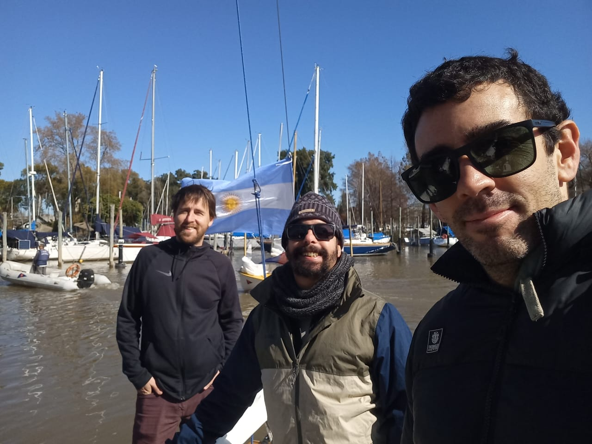

- [2023/08/05 - PRACTICA - Primer salida con un Rio de la Plata](#20230805---practica---primer-salida-con-un-rio-de-la-plata)
  - [Armado del barco](#armado-del-barco)
  - [Fuerzas que intervienen en la salida](#fuerzas-que-intervienen-en-la-salida)
  - [Amarrar el barco](#amarrar-el-barco)
  - [Nudos](#nudos)
  - [As de guía](#as-de-guía)
    - [Llano](#llano)
    - [Ballestrinque](#ballestrinque)
    - [Adujar las escotas](#adujar-las-escotas)

# 2023/08/05 - PRACTICA - Primer salida con un Rio de la Plata

 

## Armado del barco

1. Sacas la carpa y la guardas
2. Gallardete y bandera
3. Defensas fuera
4. Revisas si hay agua y si hay achicas
5. Bajas la quilla
6. Drizas de la mayor y de la de proa
7. Chequeas motor
8. Sacas la amarra de proa
9. Agarras amarra de popa, vas caminando lentamente hacia pra y cuando se acomoda el barco, la soltas
10. Con motor en marcha, timon derecho y salis

## Fuerzas que intervienen en la salida

- Viento
- Corriente
  - Si esta subiendo el agua la corriente se mete por el canal del club y luego sale 
  - Si esta bajando el agua

> Salir siempre con el motor en marcha

## Amarrar el barco

- Si la corriente te arrastra le apuntas a la popa del barco que esta al lado ??
- Si la corriente viene en contra el apuntas pasado ??

## Nudos

## As de guía

> Podes hacer una vuelta por la mano y siempre te queda bien el as

<iframe width="560" height="315" src="https://www.youtube.com/embed/_PGS0hQyPJw" title="YouTube video player" frameborder="0" allow="accelerometer; autoplay; clipboard-write; encrypted-media; gyroscope; picture-in-picture; web-share" allowfullscreen></iframe>

### Llano

> Para los tomadores de la mayor
>
 <iframe width="560" height="315" src="https://www.youtube.com/embed/jtJ7ZkGbHHw" title="YouTube video player" frameborder="0" allow="accelerometer; autoplay; clipboard-write; encrypted-media; gyroscope; picture-in-picture; web-share" allowfullscreen></iframe>

### Ballestrinque

> Para las defensas
>

<iframe width="560" height="315" src="https://www.youtube.com/embed/T3CByQOjwas" title="YouTube video player" frameborder="0" allow="accelerometer; autoplay; clipboard-write; encrypted-media; gyroscope; picture-in-picture; web-share" allowfullscreen></iframe>

<iframe width="560" height="315" src="https://www.youtube.com/embed/FiBlv0mEcZ4" title="YouTube video player" frameborder="0" allow="accelerometer; autoplay; clipboard-write; encrypted-media; gyroscope; picture-in-picture; web-share" allowfullscreen></iframe>

### Adujar las escotas

<iframe width="560" height="315" src="https://www.youtube.com/embed/RQCt1xMVmu8" title="YouTube video player" frameborder="0" allow="accelerometer; autoplay; clipboard-write; encrypted-media; gyroscope; picture-in-picture; web-share" allowfullscreen></iframe>
