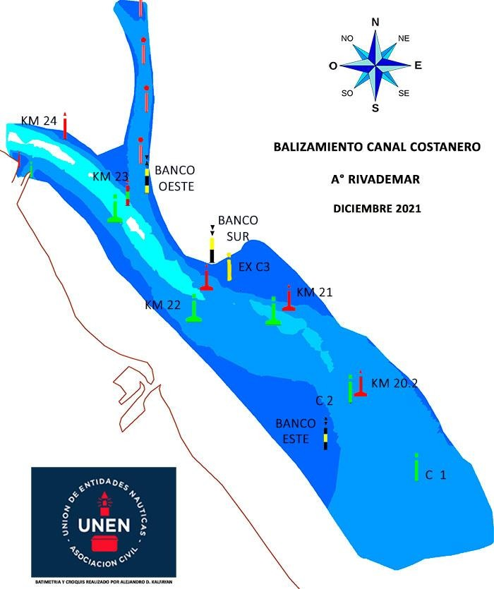

- [2023/08/18 - TEORIA - 3.](#20230818---teoria---3)
  - [Repaso](#repaso)
- [Tarea](#tarea)

-----------------
> NOTA //  
> - 
--------------------
# 2023/08/18 - TEORIA - 3. 

## Repaso 

 -  Lineas de posicion, con la pinula o lineas visuales.
 -  Puntos notables, objeto en la tierra o en algua y representado en la carta.
 -  Enfilaciones, 
    -  Dentro, montada
    -  Entremedio
    -  Franquearla, 
 -  Fuera del veril de babor, en el par 22 km verde hay algo en el agua que esta obstruyendo.
 -  Tiras una linea a una antena, y es una linea. Lo haces utilizando la pinula. Mira, compas, 
    -  Analisis de la recta aislada, de acuerdo al rumbo, confiando en mi distancia o no confiando en ninguna de los dos.
 - TECNICAS! Metodos para marcacion
    -  1. Marcacion a una unica linea de posicion /  Recta aislada.
       -  1.A. Recta aislada.
       -  1.B. Isovatas
          - Con las isovatas tambien se puede que estan en la carta.
        - 1.C. Marcacion sucesiva a un mismo punto. / Estimada, comparada con las otras dos es la mas precisa.
          - Hacer coincidir una linea de pocision, tenes un solo punto notable.
          - Corrige 
          - A una hora bitacora determinada, con un rumbo determinado x, y hace dias no tenes pocision, de repente tenes un faro o una antena.
            - Rumbo, tiras una lina de pocision.
            - Mantener rumbo y velocidad!
            - Volves a tomar marcacion a los 15 minutos al mismo punto notable.
            - Cada 5 minutos, observas la corredera que mide la velocidad de propulsión.
              - Me cambia la velocidad a 4 nudos
              - Se va 6 nudos
              - Baja a 2 nudos
              - Volocidad promedio 4 nudos
            - > Velocidad de propulsion a la superficie.
            - > Velocidad efectiva.
            - Ejemplo: 
              - Primera marcacion, se tira un trazo
                - Hb: 10:00
                - Rumbo: 340
                - Velocidad de prop: 4 nudos
                - Marcacion: 1era marcacion magnetica
              - Segunda marcacion, se tira dos trazos 
                - Hb: 10:15
                - Rumbo: 340
                - Velocidad de prop: 4 nudos
                - Marcacion: 1era marcacion magnetica
              - Con hora y velocidad obtenes distancia
                - V= 4kn = 4nm/h 
                - * .25 h 
                - D = 1milla
              - Compas, latitudes, 1 minuto es una milla nautica.
              - Vas con el compas a la primera marcacion y con la distancia de 1 milla te da el punto.
              - Llevas la primera linea de pocision al punto de la distancia usando las reglas paralelas.
              - Cruzas las dos lineas.
              - > Aprender a trasladar la recta con las reglas paralelas.
              - OTRO CASO
                -  Si me dio fuera del triangulo 7 millas por ejemplo.
                -  La tecnia es lo mismo pero unis las rectas por la izq.
             -  Tolerancia son 30 minutos max para trasladar rectas.

            - Entrenar tu hojo, te fijas de ves de una boya a otra de KM.
    -  2. Marcaciones simultanesa a dos puntos, es una de las tecnicas.
       -  Pinula marcacion 1 antena, rumbo, velocidad, hora bitacora y marcacion magnetica1.
       -  Puntla marcacion 2 catedral rumbo, velocidad, hora bitacora y marcacion magnetica1.
       -  Con estas dos obtenes latitud y longitud y completas la navegacion en cada punto.
    -  3. Marcacion simultana a 3 puntos, si las 3 coinciden en un punto es un FIX perfecto.
       -  Cuando te da un triangulo hay una deformacion en la lectura
       -  Si te da un triangulo con uno de los vertices se da a la fuga, no confio en la marcacion. Triangulo erroneo. Cuando el triangulo no se da a la fuga, lo tomas como valido. 
          - Sacas la bicectris, la mitad de cada angulo y esa es mi pocision mas probable. 
    -  4. Marcacion magnetica y enfilacion entre la antena y la linea de posicion.
          - Enfilacion a crujia
          - Cuando se alinean se dice top, el de la pinula hace la lectura.  
          - Vas a la carta unis los puntos notables sacas la linea.
     - 5. Dos enfilaciones, simultanea por medio de dos enfilaciones
       - Catedral y una antena
       
    - Para minimizar el error, cuando tomas marcaciones, y si son 3 tiene que existir una tecnica de marcacion, por la cenida y aleta, y por ultimo traves.
      - El traves es una marcacion precisa pero tenes que ser rapido para tomarla.
      - Tiras a cenida, aleta, travez. 
      - Tiras aleta, cenida, travez.  
    -  Marcaciones de seguridad, un triangulo donde no queres pasar.
    -  R, V, Hb, marcacion. Waypoint. 
    -  Hacia donde voy, cual es la velocidad del barco y si pasa algo podes dar tu ultima posicion. 
 -  Marcacion: Igual que el rumbo, pero ahora desde el norte magnetico hasta el punto notable.
 -  Siempre llevar la marcacion a la carta con el desvio magnetico para obtener la marcacion verdadera.

> Mv = Mm + Dm
> Mv = 230 + 20

> Marcación de Domingo a la mañana
  > Marcación magnética 250 grados a catedral, verdadera de 240
  > Rumbo magnético 300 grados 
  > Enfilado entre beril babor 21 y estribor 22

  # Tarea
  - Comenzar con los ejercicios de navegación timonel 
    - Colonia 1, 2, 3, 6, 7. 
    - Carta Arg 1,2,3,4,5,6,7