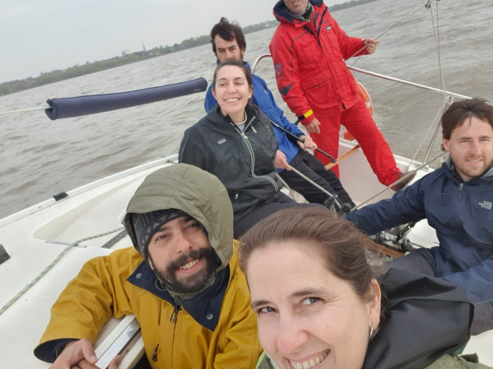
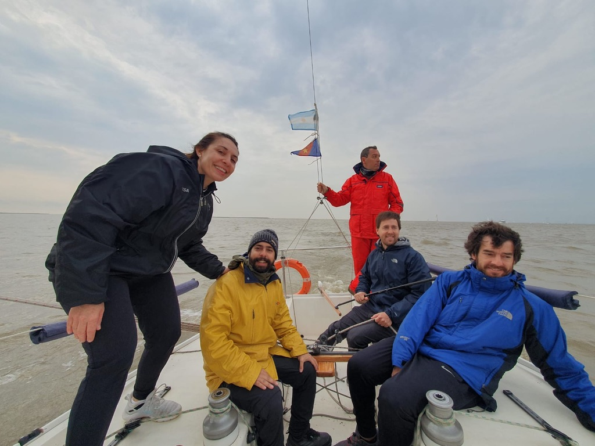
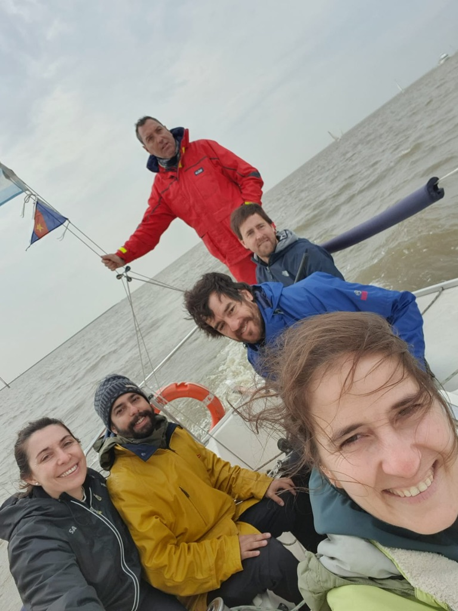

- [2023/09/02 - PRACTICA - Salida con J24](#20230902---practica---salida-con-j24)
  - [Ejercicios de amarra](#ejercicios-de-amarra)

-----------------
> NOTA //  
> - 
--------------------
# 2023/09/02 - PRACTICA - Salida con J24

## Ejercicios de amarra

CASO1.
   Viento del este
   Corriente sube

  Orden1> Suelto amarra de proa,
  Accion1> NO HAY ACCION. con timon no!
  Orden2:  Camino con la amarra de popa a proa
    cruza travez 
    accion2: timon a estribor
  Ordern 3: cambio de banda la amarra
    pasa: el barco se pone a favor de la corriente
  Orden 4: camino a popa
  Orden5: suelto

  > TAREA: HACER EJERCICIO DE AMARRA 