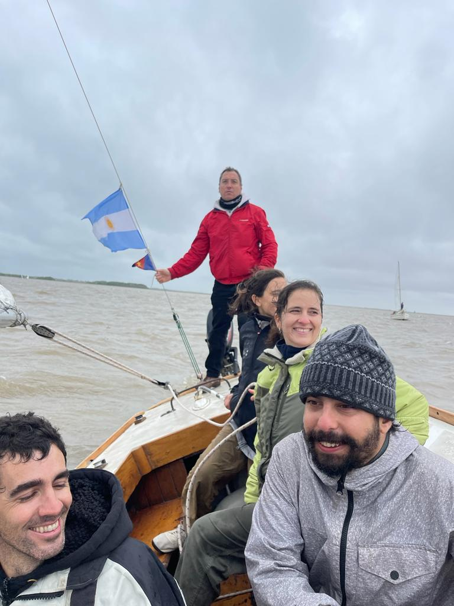
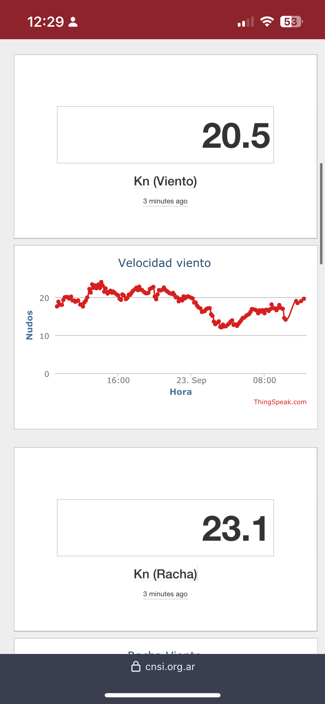

- [PRACTICA - 2023-09-23 - 8. Salida con Rio de la plata](#practica---2023-09-23---8-salida-con-rio-de-la-plata)
  - 
  - [Ejercicio](#ejercicio)

-----------------
> NOTA //  
> - 
--------------------
# PRACTICA - 2023-09-23 - 8. Salida con Rio de la plata

> NOTA // 

##  

## Ejercicio

- Rumbo 300 marcacion 240
- 14:55 hora bitacora
- Vel 5 nudos
- 235 
- 10 min de navegacion
- Punto notable la catedral