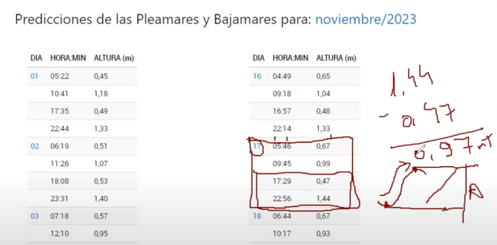
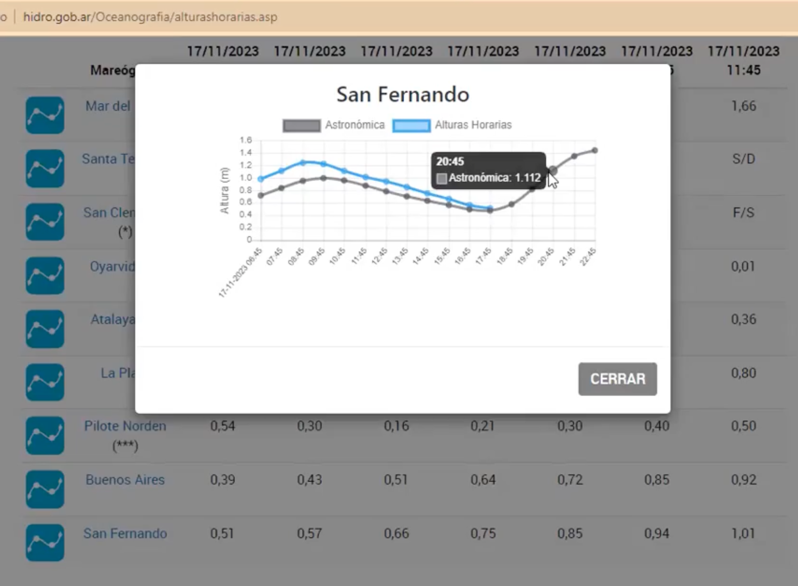

- [Mareas](#mareas)
  - [Influencia de la Luna](#influencia-de-la-luna)
  - [Tipos de mares predominantes segun sus frecuencias](#tipos-de-mares-predominantes-segun-sus-frecuencias)
  - [CICLOS DE MAREAS EN UN PLANO](#ciclos-de-mareas-en-un-plano)
  - [Primer analisis, profundidad necesitas para pasar un determinado lugar.](#primer-analisis-profundidad-necesitas-para-pasar-un-determinado-lugar)
  - [Siguiente analisis, entender el movimiento de la marea.](#siguiente-analisis-entender-el-movimiento-de-la-marea)
    - [Primer pregunta,  A tal hora cuanta agua voy a tener?](#primer-pregunta--a-tal-hora-cuanta-agua-voy-a-tener)
    - [Segunda pregunta,  A que hora yo podria salir/entrar.](#segunda-pregunta--a-que-hora-yo-podria-salirentrar)
  - [Regla de duodecimos](#regla-de-duodecimos)

-----------------
> NOTA //  
> - 
--------------------
# Mareas

Mareas.mp4
https://drive.google.com/drive/folders/1qaVMXUrYHP_cJFxJOCaRkohm0FDnyKZF

## Influencia de la Luna

 -  Fenomeno astronomico producido por la luna y el sol
    -  El que mas afecta es la luna 
    -  Fuerzas centripetas
       -  Pelota de tenis, hilo, mano es la tierra pelota es la luna, genera una tension en el hilo, se la define como fuerza centripeta, las masas se desplacen por ese movimiento.
 -  Fases de la luna / Cuarto creciente, cuarto menguante, luna llena, luna nueva.
 -  Afectan a las mareas reinantes del lugar
 -  Que fenomentos meteorologicos afectan a ese lugar, de acuerdo a la frecuencia del lugar.
 -  Predominantes del Rio de la plata, del sudeste, 
    -  Afectan al predominante, a la marea vientos del norte y noroeste, sur y sureste.
    -  El del norte, hace que no crezca tanto la marea.
    -  Una bajante y 3 dias viento del norte, se seca el rio de la plata y le sumas una cuadratura o sicigia, se seca mas / una extraordinaria. / Fenomento astronomico y meteorologico.
    -  Luna se interpone entre el sol y la tierra, luna nueva, no la ves.   marea de sisigias. 
    -  Sol, tierra, luna. llena marea de sisigias. 
    -  Sisigias incrementan la marea, cuadratura disminuye la marea. Generan movimientos extraordinarios en la marea.
    -  N.M.M. Nivel medio del mar, es la cota cero del oceano. ahi es donde se plantan los movimientos de amplitudes de mareas.  Es el promedio de todas las pleas y de todas las bajas.
    -  Amplitud es la distancia entre la baja y la plea. 
       -  Pleamar de sicigia. La mas alta. La bajamar mas potente la de sicigia. Efectos astronomicos. 
       -  Pleamar de cuadratura.
    -  La cota inicia en P.R.S. linea imaginaria, no es el lecho del rio, es como otra cota, promedio de las mas bajamares. De ahi para arriba se hace el analisis de la plea y de la baja. 
    -  Amplitud de sisigia, y amplitud de cuadratura.
    -  Analisis sinusoidal. Asi se hace el analisis de mareas. El grafico de la amplitud de sisigia .
    -  Amplitud de marea, distancia entre una plea y una baja.
    -  Mareas de sicigia, mareas de cuadratura.
    -  1 dia lunar 24hs 50 minutos 28 segundos. Retardo de 50 minutos por dia. 
    -  1 dia solar 24hs.

## Tipos de mares predominantes segun sus frecuencias
Tipos de frecuencias
- Semidiurnas, 2 plea y 2 bajamar en el transcurso de un dia lunar. Rio de la plata. Cada 6h 13m se produce una plea o baja.
- Diurnas, en latitudes bajas, con una plea y una baja en el transcurso del dia lunar, cambios cada 12hs 25m. 
- Diurnas irregulares, dos ciclos por dia lunar pero con marcada diferencia enlas alturas y en los periodos tiempos.
- Mareas Mixtas, intermedio, dos pleamares y una bajamar, o dos bajamares y una pleamar.

> Pregunta de examen: En el rio de la plata, semidiurna con desigualdad diurna, vulgarmente marea mixta con preponderancia a semidiurna. 

- Proceso Estoa, parte superior y parte inferior de la sinusoide. Movimiento estatico.

## CICLOS DE MAREAS EN UN PLANO

La altura del faro esta tomada an nivel medio del mar de la cota referncia de la zona.

Analisis matematico.
2 Tecnicas para predecir movimientos de la marea. 
  - Tabla A, tabla de interpolacion.
  - Sistema matematico, si no tenes la tabla.
Hay muchas tecnicas, abaco, carta nautica, a nivel astronomico la marea.

Cota profundidad
 - plomada con cabo, escandayo. No tenes ecosonda, tiras el escandayo, y ves la profundidad. Plomada con nudo cada metro o medio metro. 8 nudos, 8 metros. Es concava y toma muestra del lecho marino, cuando levantas ves que tipo de lecho es.
 - eco sonda, te da la profundidad.

Cota calado
Calado de los barcos
- Rio de la plata , 1.30m con orsa, 0.30 sin orsa.
- Mistic 1.20 y 1.30
- Avan 1.15
- J24 1.40

Cota margen de seguridad. Del lecho hasta la cota.

C + MS = P

En Uruguay se dice encarar, rompes barco
En Arg varar, fondo blando.

PRS  = Valor historico de las maximas bajamares del lugar.
S = Sondaje. Distancia entre lecho marino y PRS.

S- , sondaje negatico. Sale del promedio de las maximas bajamares.
  Sisigia de bajante, aparecen los S-, se seca el rio de la plata. Aparecen los bancos.

P = S + H
P = C + MS
H + S = C + MS  / Todas las variables. Que altura de seguridad necesias para ir a colonia. Calado, sondaje del lugar, altura de marea, te fijas en la tabla de marea y analisis a que hora podes salir.

En la carta te tira sondaje, en metro. Es sondaje.
Hay que sumarle el H. altura de marea. lo que te da la separata, la tabla de marea.

## Primer analisis, profundidad necesitas para pasar un determinado lugar.
Cuanta profundidad necesitas para pasar un determinado lugar.

Servicio de hidrografia naval argentina. Es lo mismo que la separata.
Lista de puertos patrones, es donde se hacen los analisis de mareas.
- San isidro no e sun puerto patron, es un puerto secundario.
- Te vas al mas cercano, san fernando.
- Seleccionas el mes.
- Ejecutar consulta.  Te da lo mismo que la separata.
  - Te devuevle toda la data del puerto patron. 
  - Te dice dia, hora, altura de marea.
  - Miras para el dia, te quedas con los 4 registros, horas minutos, y altura.
  - Flujo o reflujo? 
    - Flujo, sube la marea.
    - Reflujo, baja la marea.
- Movimiento es sinusoidal, no es lineal! no graficar con rectas!
- Calculo amplitud, restas la actual con la anterior. Lo obtenes de la tabla.
  - 
- Duracion
  - Tiempo que transcurre entre una baja y una plea es la duracion.
  - Restas un horario al anterior, 5hs 27min. / 6hs, 5,45.
  - 
-  La tabla dice 22.56 1.44, en san isidro cuanto agua tengo, te fijas la carta y dice 0.7. Sumas 1.44+0.7 = 2.14.
   -  El valor de la tabla, + el sondaje, te da la altura de marea. Pueden existir correcciones. 
  - 

En la separata, pones puerto patron, mes, dia, y te da la altura de marea.

## Siguiente analisis, entender el movimiento de la marea.

### Primer pregunta,  A tal hora cuanta agua voy a tener?

Que altura de marea tengo.
Calculas dur, amplitud, intervalo, tabla, y luego tenes la correcion. 
Amplitud, e intervalo mas cercano entras a la tabla.

  - 
  - Si caes en esa hora la tabla te lo dice, le haces las correcciones astronomicas o meteorologicas, mas sondaje o menos sondaje si es negativo. Si es negativo la ves a la montaña no vas a pasar.
  - Si estas en el medio de las horas la tabla te lo da lo mas precisa posible.
  - 
  - No podes hacer regla de 3 simple siempre hay un margen de error. Altura queres saber, que altura voy a tener 11 am. La regla de 3 trabaja como recta, no como sinusoidal.
  - 2 factores de correccion, pones un punto para arriba y para abajo, correccion y correccion prima, para duracion lo mismo, intervalo e intervalo prima. Usar los valores mas chicos. 
    - una correccion, y un intervalo.
    - una correccion primar y un intervalo prima.
    - 
    - Como calcularlo. 10.40hs? 
      - Cual es el intervalo mas cercano.
        - Restas horario que queres saber con el anterior, 
          - GANA. 10 40 - 7hs 48m = 2h 52m.
          - 14 18- 10 40 = 3h 38m.
      - Cual es la duracion y cual es la amplitud.
        - Amplitud, dif entre plea y baja.
          - 5.66-1.30 = 4.36
        - Duracion dif entre una baja y una plea.
          - 14.18 - 7.48 = 6.30
      - D= 6.30 / Tiempo entre una plea y una baja.
      - A= 4.36 / Movimiento entre una plea y una baja. o sube o baja.
      - I= 2.52 / Tiempo transcurrio al horario especifico.
      - Vas a la tabla, tabla A. Para calcular en un instante determinado.
        - Que me falta, la correcion!
        - Entras por el margen izq que es de la duracion. 6.30hs hasta encontrar el intervalo mas cercano al valor que tenes. 2.52hs. No esta pero el mas cercano es 2.49hs.
        - Abajo hay numeros romanos, te quedas en esa columna y luego entras por el valor de la amplitud. 4.36. optas por 4.40.
        - Te da un valor de 1.74. columna n13.
        - Es el valor de correcion. Esta asociada a las alturas.
        - 
        - Ahora hay que sumar esta correcion o restar dependiendo en que momento estoy.
        - En este caso el valor de la plea era a las 07.48hs. quiero saber a las 10.40, la marea esta bajando, entonces se resta.
        - 
        - La tabla calcula las acelaraciones y desaceleraciones de la marea.

### Segunda pregunta,  A que hora yo podria salir/entrar.

Quiero salir con tanta agua debajo de mi quilla. aplicar el procedimiento inverso. Te plantas en la cantidad de agua que necesitas.

A que hora yo podria salir.

Saber la hora a la que voy a entrar a puerto, salir del puerto.
Entras al reves a la tabla, entras por la amplitud, tenes el factor de correcion, subis, y con la duracion de la marea obtenes el intervalo.
Y con este obtenes la hora.

## Regla de duodecimos

> No tenes nada vas con esta tecnica.

La duracion la divids en 6, te da 1h 5m.
Altura 4.36 / 12 = 0.36

La marea valia proporcionalmente.
Sextas partes.
- Primer sexto, 1/6 de A 
- Segundo sexto, 2/6 de A 
- Tercer sexto, 3/6 de A 
- Cuarto sexto, 3/6 de A 
- Quinto sexto, 2/6 de A 
- Sexto sexto, 1/6 de A 

Representas la ascelarion y desaceleracion de la marea, proceso sinusoidal.

Dibujando la sinu, dividis en 6. 1,2,3,3,2,1.

Horas
1. 07.48 + 1.05 = 08.53
2. 08.53 + 1.05 = 09.58
3. 09.58 + 1.05 = 11.03
4. 11.03 + 1.05 = 12.08
5. 12.08 + 1.05 = 13.13
6. 13.13 + 1.05 = 14.18

Alturas
1. 5.66 - .36 = 5.30  // 0.36 es 1 dudecimo de la amplitud.
1. 5.30 - .72 = 4.58 // 0.72 es 2 duodecimos de la amplitud.
1. 4.58 - 1.08 = 3.50 // 1.08 es 3 duodecimos de la amplitud.
1. 3.50 - 1.08 = 2.42 // 1.08 es 3 duodecimos de la amplitud.
1. 2.42 - .72 = 1.70 // 0.72 es 2 duodecimos de la amplitud.
1. 1.70 - .36 = 1.34 // 0.36 es 1 duodecimo de la amplitud.

----

3 escalones y esta bajando.

